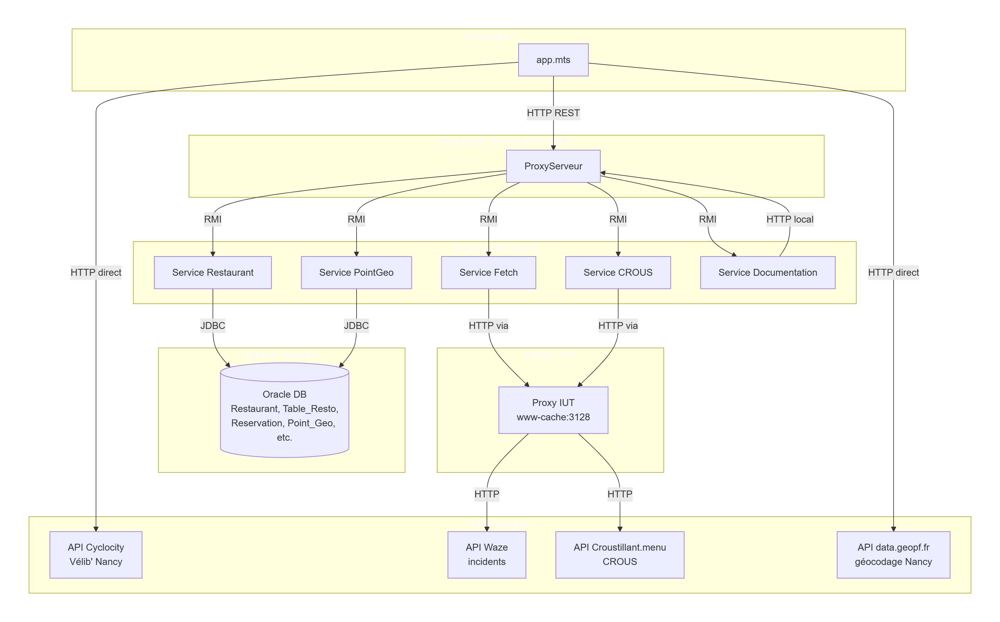
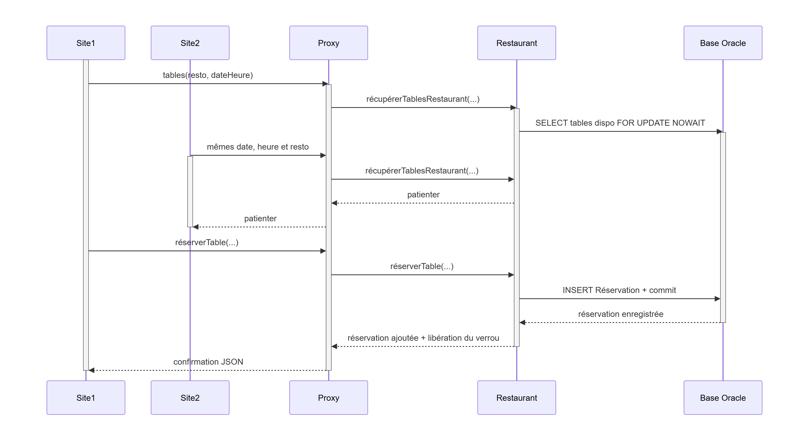
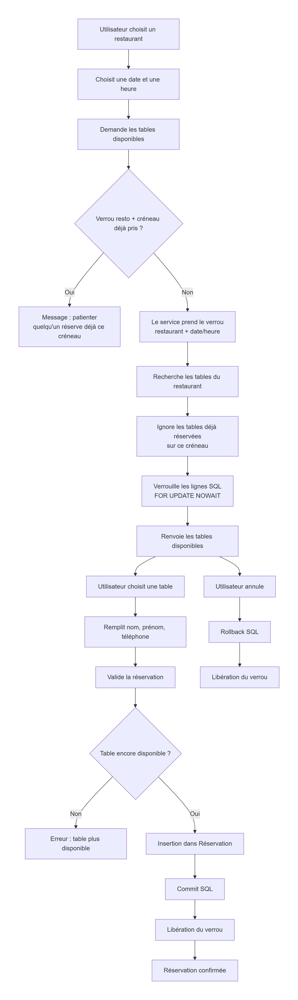
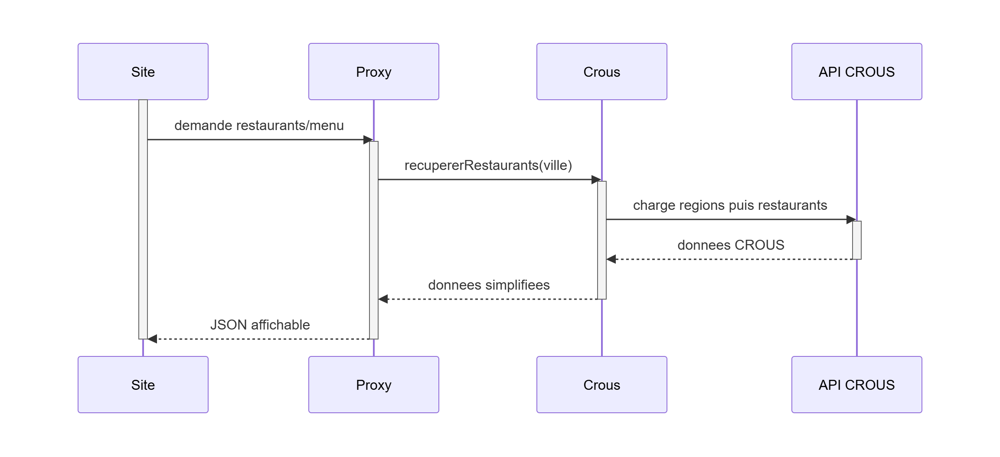
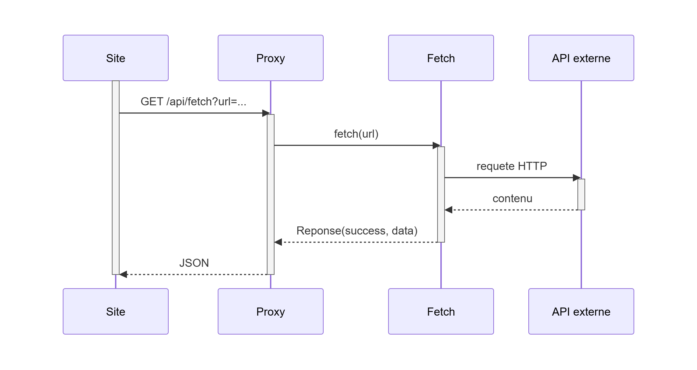
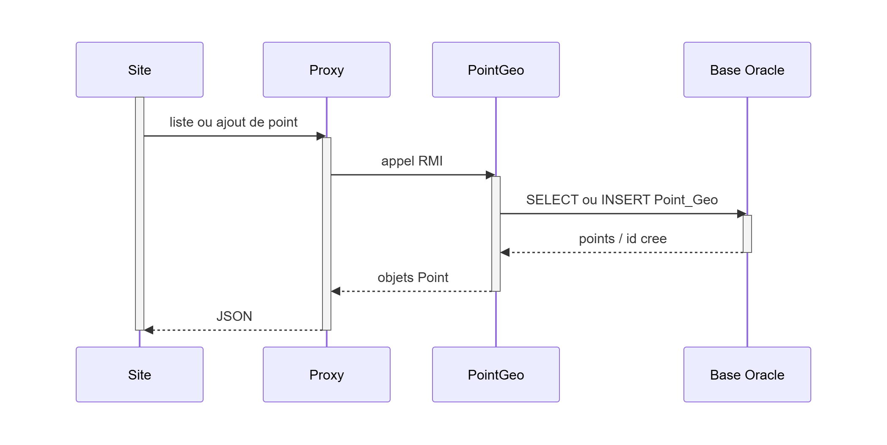

# Documentation des services - Application Répartie BUT S4

---

## Schéma global de communication

## Documentation par service

### Service Documentation

Le service Documentation est le **point d'entrée centralisé** pour consulter la documentation de tous les autres services de l'application. Il joue le rôle d'intermédiaire entre le navigateur et les services RMI.

Quand l'utilisateur clique sur un bouton dans le panneau de documentation, le navigateur appelle le proxy HTTP sur `/api/documentation/{service}`. Le proxy transmet alors la demande au service Documentation via RMI avec le nom du service demandé.

Le service Documentation reçoit ce nom et fait à son tour une requête HTTP vers le proxy sur l'endpoint interne `/api/services/documentation/{service}`. Cet endpoint appelle directement la méthode `chargerDocumentation()` du service RMI concerné (Restaurant, CROUS, Fetch ou PointGeo), qui retourne sa propre documentation HTML.

Pour sa propre documentation, le service ne fait pas d'appel HTTP : il retourne directement ce texte, évitant ainsi une boucle infinie.

### Service Restaurant

Le service Restaurant gère les restaurants, les tables disponibles et les réservations. Le site commence par demander la liste des restaurants avec leurs coordonnées pour les afficher sur la carte.

Quand l'utilisateur veut réserver, il choisit d'abord une date et une heure. Le service cherche alors les tables du restaurant qui ne sont pas déjà prises sur ce créneau. Une réservation dure une heure, donc une table réservée à midi est considérée occupée jusqu'à 13h.

Pour éviter que deux personnes réservent en même temps le même restaurant au même horaire, le service prend un verrou sur le couple restaurant + date/heure. Il verrouille aussi les lignes SQL des tables disponibles avec `FOR UPDATE NOWAIT`. Si une autre personne est déjà en train de réserver ce même créneau, le service renvoie un message demandant de patienter.

Quand l'utilisateur valide la réservation, le service vérifie une dernière fois que la table existe, que le nombre de convives est correct, et qu'aucune réservation ne chevauche ce créneau. Ensuite il insère la réservation en base et libère le verrou.

---

### Service CROUS

Le service CROUS sert à afficher les restaurants universitaires et leurs menus. Le site demande d'abord les restaurants pour une ville, par exemple Nancy. Le service interroge l'API CROUS, cherche la région qui correspond à cette ville, puis récupère les restaurants de cette région.

Quand l'utilisateur clique sur un restaurant CROUS, le proxy demande ensuite au service de charger le menu. La réponse de l'API contient beaucoup d'objets imbriqués. Le service transforme donc ces données en un texte simple, avec la date et les plats classés par repas et par catégorie.

Le service CROUS est donc un **traducteur** entre l'API externe et notre application. Il cache les détails compliqués de l'API et renvoie des données plus faciles à afficher dans le navigateur.

**API externe utilisée :** `https://api.croustillant.menu/v1/`

---

### Service Fetch

Le service Fetch sert à récupérer le contenu d'une URL pour les autres parties de l'application. Le navigateur ne va pas toujours appeler directement les API externes. Il passe par le proxy HTTP, puis le proxy demande au service Fetch de faire la requête. Le service Fetch utilise lui-même le proxy de l'IUT (`www-cache:3128`) pour faire la requête, ce qui lui permet d'accéder à des ressources externes que le navigateur ne peut pas atteindre directement à cause des règles de sécurité CORS.

Concrètement, le proxy envoie une URL au service Fetch. Le service vérifie l'URL, fait la requête avec la méthode HTTP partagée du projet (`HttpClientUtils.fetchUrl()`), récupère le texte de la réponse, puis le renvoie dans un objet `Reponse`. Si l'URL est mauvaise, si le réseau ne répond pas, ou si la requête est interrompue, le service renvoie une erreur simple au lieu de faire planter tout le programme.

Ce service est utile car il **centralise les appels externes**. Les autres services n'ont pas besoin de connaître les détails du client HTTP ou du proxy de l'IUT.

**Utilisé pour :** récupérer les incidents Waze (`https://carto.g-ny.eu/data/cifs/cifs_waze_v2.json`)

---

### Service PointGeo

Le service PointGeo sert à gérer les points ajoutés par les utilisateurs sur la carte. Un point contient des coordonnées, un emoji, un titre et une description. Ces informations sont stockées dans la base de données pour pouvoir les retrouver plus tard.

Quand le site charge la carte, le proxy appelle le service PointGeo pour récupérer tous les points. Le service lit la table `Point_Geo`, transforme chaque ligne en objet `Point`, puis renvoie la liste au navigateur.

Quand un utilisateur ajoute un point, le site envoie les coordonnées et le texte au proxy. Le proxy appelle ensuite le service PointGeo. Le service insère le point en base, récupère l'identifiant créé, puis renvoie le nouveau point pour que la carte puisse l'afficher directement.

**Endpoints exposés par le proxy :**

| Endpoint           | Méthode | Service RMI appelé         |
| ------------------ | ------- | -------------------------- |
| `/api/points/list` | GET     | `recupererTousLesPoints()` |
| `/api/points/add`  | POST    | `ajouterPoint()`           |

---

## Lancement des services

Voir [`docs/deploiement.md`](docs/deploiement.md) pour le guide complet de déploiement Java, et [`docs/deploiement_web.md`](docs/deploiement_web.md) pour le frontend TypeScript.
